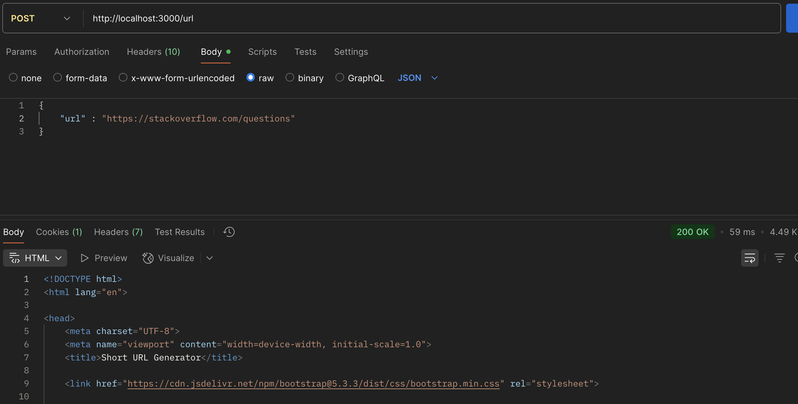
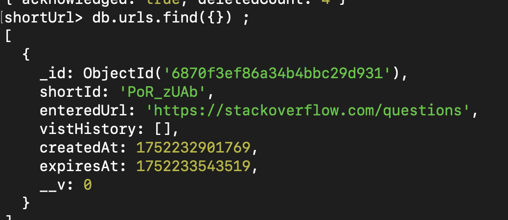
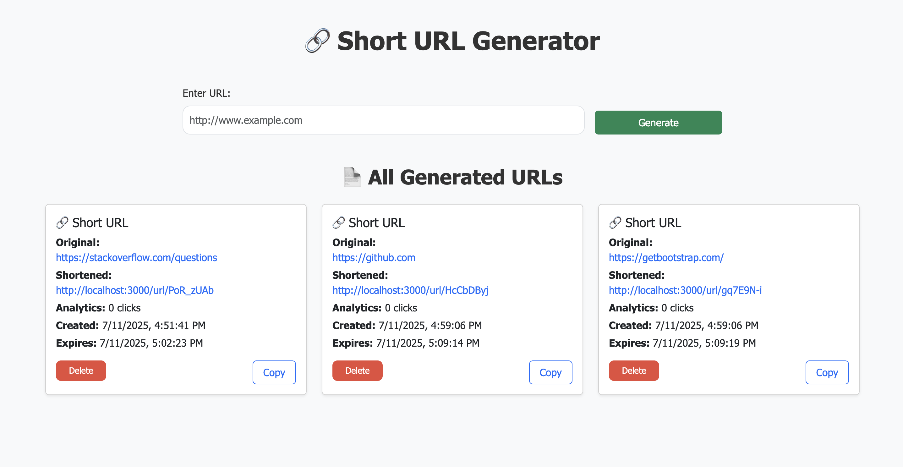
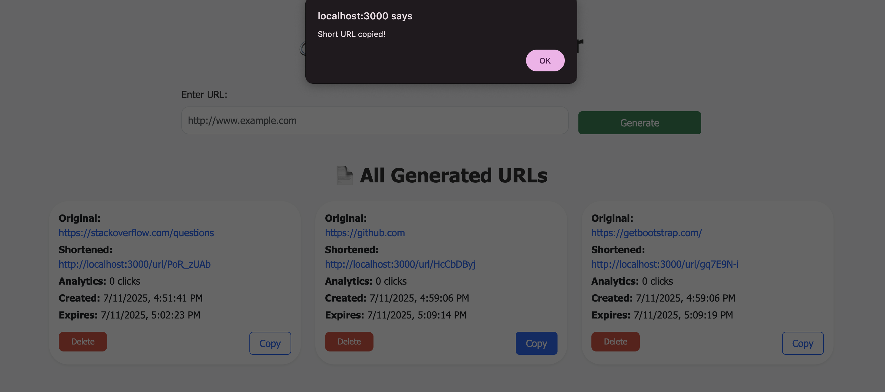
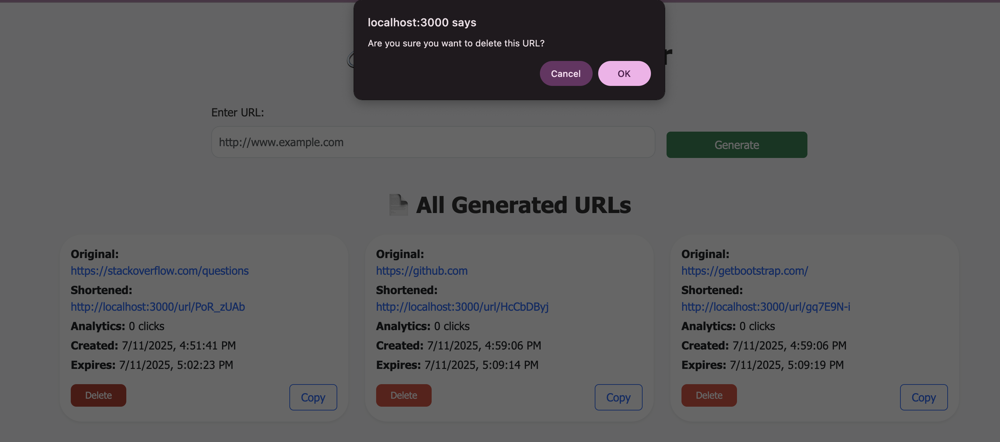

# 🔗 URL Shortener App

A full-stack URL shortening service that lets users:
- 🔒 Shorten long URLs
- 📊 Track click analytics
- ⏳ Set expiration dates
- 📋 Copy links with one click

## 🚀 Features

### 🔐 Shorten any long URL

**Screenshot:**
-Home Page

-POST Route Testing 

-IN DATABASE (based on the above screenshot)

-FRONTEND for seamless user interactivity

-Copy to Clipboard 

-Delete URL 

## 🛠️ Tech Stack

| Layer     | Technology                |
|-----------|---------------------------|
| Backend   | Node.js, Express.js       |
| Database  | MongoDB (Mongoose)        |
| Frontend  | HTML, CSS, Bootstrap, JS , EJS |

### GET /
- Gets the frontend

### POST /url

- Runs the backend logic and generated SHORTID . 

### GET /url/:id

- Redirects to the Original URL when the shorten URL is cliked . 

### DELETE /url/:shortId/delete

- Deletes the entire URL entry data from the database