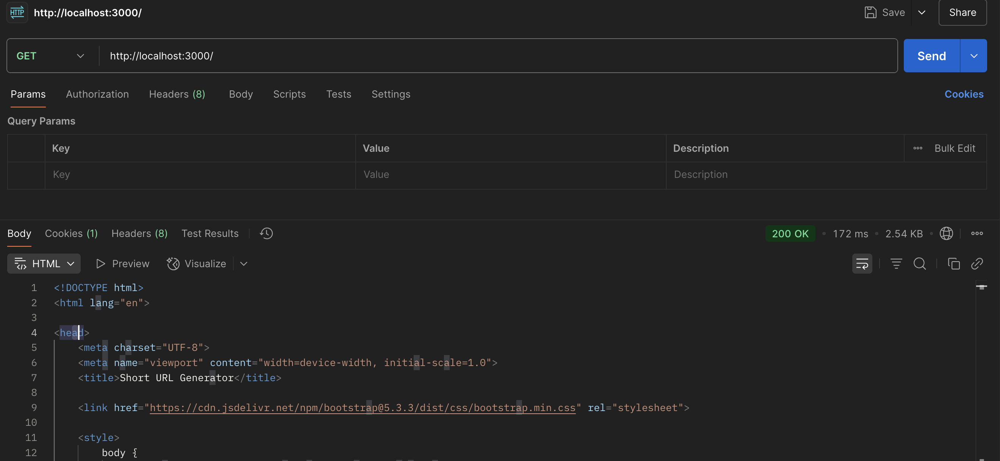

# 🔗 URL Shortener App

A full-stack URL shortening service that lets users:
- 🔒 Shorten long URLs
- 📊 Track click analytics
- ⏳ Set expiration dates
- 📋 Copy links with one click

## 🚀 Features

### 🔐 Shorten any long URL

**Screenshot:**
-Home Page

-POST Route Testing 

-IN DATABASE (based on the above screenshot)

-FRONTEND for seamless user interactivity

-Copy to Clipboard 

-Delete URL 

## 🛠️ Tech Stack

| Layer     | Technology                |
|-----------|---------------------------|
| Backend   | Node.js, Express.js       |
| Database  | MongoDB (Mongoose)        |
| Frontend  | HTML, CSS, Bootstrap, JS , EJS |

---

### GET /
- Gets the frontend

### POST /url

- Runs the backend logic and generated SHORTID . 

### GET /url/:id

- Redirects to the Original URL when the shorten URL is cliked . 

### DELETE /url/:shortId/delete

- Deletes the entire URL entry data from the database

---

### 💻 Local Setup Instructions

1. Clone the repo  

- git clone https://github.com/your-username/url-shortener.git
- cd url-shortener

2. Install dependencies  

- npm install 

3. Configure `.env`  

- PORT=3000
- MONGO_URL=mongodb://localhost:27017/Short_url
- SESSION_SECRET=shorturlsupersecret11

4. Run the server

- nodemon index.js

5. Then visit
- 📍 http://localhost:3000

## 📝 License

This project is licensed under the [MIT License](https://opensource.org/licenses/MIT).

